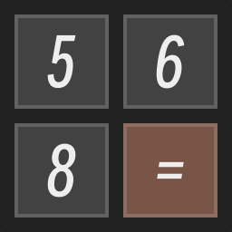

    

> 🌏简体中文 | [繁體中文](https://Calc.PJ568.eu.org/?language=chinese_traditional) | [日本語](https://Calc.PJ568.eu.org/?language=japanese) | [한어](https://Calc.PJ568.eu.org/?language=korean) | [English](https://Calc.PJ568.eu.org/?language=english) | [Español](https://Calc.PJ568.eu.org/?language=spanish)

> 🗃️[Github](https://github.com/PJ-568/568_Calc) | [Gitee](https://gitee.com/PJ-568/568_Calc)

# 568_Calc

*  568_Calc 是一个简单的多平台支持的计算器。

## 📖其他说明

* `本项目和其使用的开源项目允许修改，但请保留原作者信息。确需去除，请联系作者，以免失去技术支持。`
* 出现 BUG 请提出 `Issue` ，我会修复。
* 期待您的 `Commitment` 。

## 🏆贡献者们

> 感谢所有让这个项目变得更好的贡献者们！

## 💻代码贡献

欢迎每一位对本项目感兴趣的朋友贡献代码。

### 参考

* Fork 源码，下载到本地并运行项目；
* 添加/修改代码；
* <b style="color:red">⚠️对相关改动进行全面的自我测试⚠️</b>；
* 确认无误后提交修改到 Github；
* 提交 Pull Request；

### 请注意

* 单次 Pull Request 不应提交过多修改，请确保每次提交都针对特定的功能且务必说明本次改动的具体目的，例如：修复某 bug 、优化某方法 等，方便进行 Code Review；
* 对于 bug 的修复，应该将本次 Pull Request 和相对应 bug 的 issue 关联起来，让别人知道该问题已经被修复；
* 对于较大的新功能，你需要先提交 Issues，例如 “添加 XXX 功能”，确认该功能有被添加的必要后，再开始工作；
* 对于一些主观的样式、交互逻辑调整：如颜色、图标的使用，某些预设配置的增减修改等，一般不予通过。但可以在 Discussions 中进行讨论；

* 其他如简单的代码优化、文档修正等，只要修改合理都会被接受。

## ⭐Star 历史

<a href="https://star-history.com/#PJ-568/568_Calc&Date">
  <picture>
    <source media="(prefers-color-scheme: dark)" srcset="https://api.star-history.com/svg?repos=PJ-568/568_Calc&type=Date&theme=dark" />
    <source media="(prefers-color-scheme: light)" srcset="https://api.star-history.com/svg?repos=PJ-568/568_Calc&type=Date" />
    
  </picture>
</a>

## 📄许可证

本项目遵循 [MIT license](https://mit-license.org) 许可协议。如果想了解完整许可信息，请查阅 `LICENSE` 文件。

### 🗃️附加许可证

* Godot：[MIT license](https://mit-license.org)；
  * [Github](https://github.com/godotengine/godot)；
* smiley-sans：[OFL-1.1 license](https://github.com/atelier-anchor/smiley-sans/blob/main/LICENSE)；
  * [Github](https://github.com/atelier-anchor/smiley-sans)。
